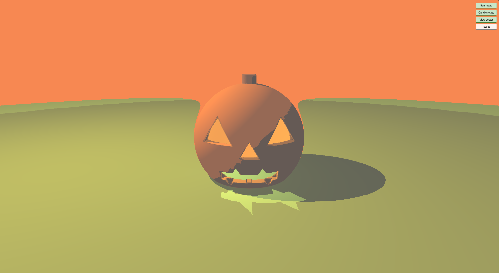
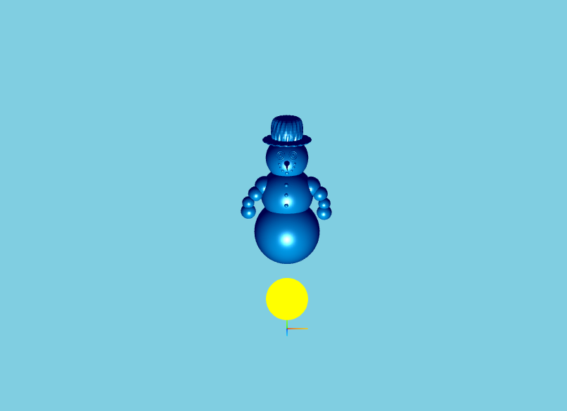
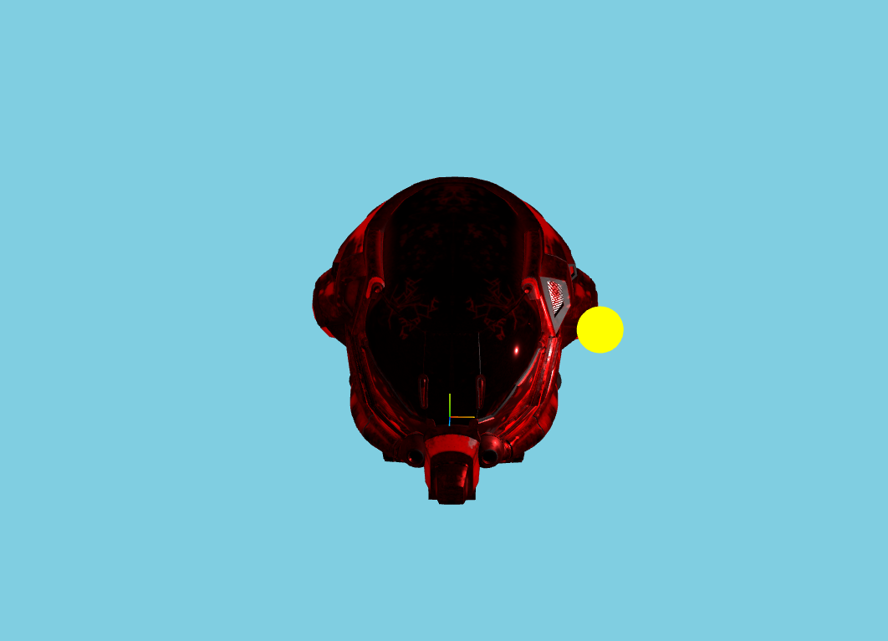

# Shading & Ray Marching — WebGL Demo

A WebGL project built with Three.js: Blinn-Phong shading, ray-marched jack-o'-lantern, and PBR-textured helmet. Run in the browser with a local server.



---

## What’s in it

- **Scene 1 — Blinn-Phong Snowman**  
  A snowman lit with the Blinn-Phong reflection model (ambient, diffuse, specular). Move the light with WASD / QE to see the shading change.

  

- **Scene 2 — Ray-Marched Jack-o'-Lantern**  
  A pumpkin carved with eyes, nose, mouth, and teeth, rendered entirely in a fragment shader via ray marching and SDFs. Optional: pumpkin parts fly in and assemble; sunset and candle lights can orbit; the camera can follow a sector path. Toggles and reset are in the top-right when this scene is active.

- **Scenes 3–8 — PBR Helmet**  
  A damaged sci-fi helmet with albedo, metalness/roughness, emissive, normal, and AO maps, plus a full PBR (MeshStandardMaterial) view.



---

## Run it

Use a **local web server** (don’t open the HTML file directly):

```bash
# From the repo root
python -m http.server 8000
# Or: npx serve
```

Then in the browser:

- **Part 1:** `http://localhost:8000/part1/A3.html`
- **Part 2 (with extra features):** `http://localhost:8000/part2/A3.html`

---

## Controls

| Key / Action | Effect |
|--------------|--------|
| **1** | Blinn-Phong snowman |
| **2** | Ray-marched pumpkin |
| **3–8** | Helmet maps (Albedo, MetalRoughness, Emissive, Normal, AO, PBR) |
| **W / A / S / D** | Move light on the xz plane |
| **Q / E** | Move light up / down |
| **Mouse drag** | Orbit camera (when applicable) |

**Scene 2 only (top-right buttons):**

- **Sun rotate** — Toggle sunset light orbiting the pumpkin  
- **Candle rotate** — Toggle candle light moving in a small circle  
- **View sector** — Toggle camera sector path (zoom in/out orbit)  
- **Reset** — Restart the pumpkin animation (fly-in and orbit time)

---

## Screenshots

| Snowman (Blinn-Phong) | Pumpkin (Ray Marching) |
|-----------------------|------------------------|
|  |  |

---

## Tech

- **Three.js** — scene, camera, renderer, loaders  
- **WebGL 2 / GLSL** — custom vertex and fragment shaders (Blinn-Phong, ray marching)  
- **SDFs** — sphere, plane, cylinder, tri/rect prisms; union, subtraction, smooth blend  
- **PBR** — MeshStandardMaterial with albedo, metalness/roughness, emissive, normal, AO maps  

---

## Repo layout

```
├── part1/          # Core: snowman, pumpkin, helmet (no extra toggles)
├── part2/          # Same + pumpkin assembly, orbit lights/camera, 4 toggles + reset
├── images/         # Screenshots for this README
├── gltf/, obj/, js/, glsl/  # Models, textures, libs, shaders
└── README.md
```

---

## License

For personal and educational use.
